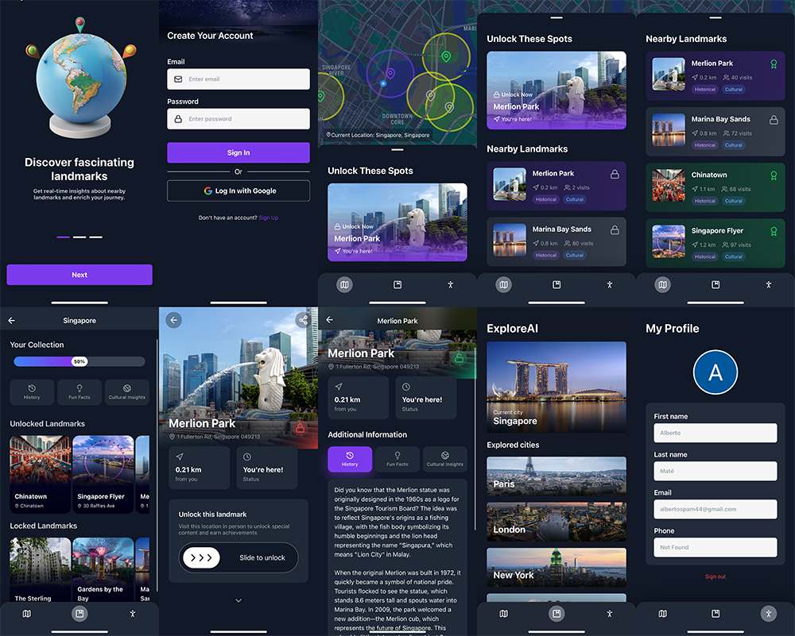

# ExploreAI

<p align="center">
  
</p>

Have you ever arrived in a city and wondered what to see? ExploreAI is a mobile application that transforms city exploration into an interactive experience. Using real-time location data and AI-powered descriptions, users can discover and unlock landmarks as they physically explore cities.

I started working on this app as a personal project where I wanted to learn more about app development in particular React Native for its cross-platform capabilities. This is the output of my learning. The app is not available on any store yet, although I would like to release it in the future.

## ✨ Key Features

- **Landmark Discovery**: Automatically creates a list of landmarks based on your current city.
- **AI-Powered Descriptions**: Provides dynamic, engaging content about landmarks using GPT-4. Access historical facts, cultural information, and interesting stories
- **Interactive Unlocking System**: Unlock landmark information by physically visiting the location
- **Progress Tracking**: Monitor your exploration progress across different cities
- **User authentication**: Securely sign up and log in with Clerk. Google Auth is also supported.
- **Modern UI/UX**: Intuitive design with animations and smooth transitions

<p align="center">
  
</p>

## 🛠 Tech Stack

The app is built on the latest tech stack:

- **Frontend**: React Native with Expo 52
- **Database**: Neon PostgreSQL
- **Styling**: TailwindCSS (via NativeWind)
- **State Management**: Zustand
- **Authentication**: Clerk
- **API Integration**: OpenAI API, Wikipedia API
- **Data Fetching**: TanStack Query

## 🚀 Getting Started

### Prerequisites

- Node.js (v16 or higher)
- npm or yarn
- Expo Go app on your mobile device
- OpenAI API key
- Clerk account and API keys
- Neon PostgreSQL account and API keys

### Environment Setup

1. Install dependencies:

```bash
npm install
```

2. Create a `.env` file and populate it with the following:

```bash
EXPO_PUBLIC_SERVER_URL="https://api.exploreai.com/"
EXPO_PUBLIC_CLERK_PUBLISHABLE_KEY="your clerk publishable key"
DATABASE_URL="your neon database url"
EXPO_PUBLIC_OPENAI_KEY="your openai api key"
```

3. Create the database using the SQL queries. See `sql.md` for more information.

### Running the App

1. Start the development server:

```bash
npx expo start -c
```

2. Scan the QR code with the Expo app on your phone

## Screens

<p align="center">
  
</p>
